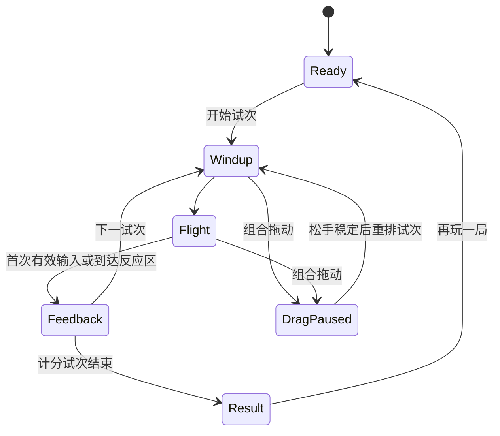

# BrainPet Go/No-Go 游戏与宠物联动交互规格

> 文档状态：Go/No-Go V2 核心可试玩；练习序列、预备动作和 Host 原始输入时钟仍待实现  
> 更新日期：2026-08-14  
> 适用范围：BrainPet 第一款真实游戏，以及后续需要“宠物向桌面反应区投掷内容”的任务  
> 当前基线：`cargo-signal` 任务版本 `2.3.0`、资源版本 `2.1.0`、参数版本 `2.2.0` 与 `brainpet-score-v2`

## 1. 结论

第一款真实游戏采用单一 Go/No-Go 任务：宠物将物体抛向固定反应区。物体离开宠物的第一帧就是刺激呈现与 RT 起点；用户对 Go 刺激左键单击游戏舞台任意位置或按空格，对 No-Go 刺激保持不动。未反应时，物体进入反应区的瞬间直接判定，不在落点停留。

宠物与反应区由同一套 `Interaction Rig` 管理，但允许用户独立摆放：

- 开局时反应区自动出现在宠物附近，随后可由用户调整。
- 拖动宠物只移动宠物；反应区保持原位，投掷起点实时更新。
- 拖动反应区只移动游戏区；宠物保持原位，投掷终点实时更新。
- 拖动期间暂停任务时钟，取消且无分地重排当前试次，避免移动窗口被记成反应错误。
- 底层可以继续使用多个 Electron 窗口，但窗口关系、拖动和坐标均由 Host 统一控制；Renderer 不自行猜测宠物位置。

正确抑制一个 No-Go 刺激固定获得 `+40` 分。Go 的速度奖励保留更高权重，但基础分同样从 `40` 起算，使心算和即时反馈足够简单。

## 2. 决策状态

### 已确认

| 项目 | 决策 |
| --- | --- |
| 任务 | 第一款真实游戏为 Go/No-Go |
| 主要动作 | Go 时左键单击游戏舞台任意位置或按空格；No-Go 时不操作 |
| 游戏入口 | 宠物显眼部位触发，不增加传统应用式启动页 |
| 舞台形态 | 无边框、透明桌面叠加层，视觉占用约屏幕 `1/9` |
| 场景组织 | 宠物投掷，物体沿弧线飞入反应区 |
| 空间关系 | 宠物与反应区可独立摆放，飞行层实时连接两端 |
| 拖动行为 | 拖动宠物只移动宠物；拖动游戏区只移动游戏区 |
| 正确 No-Go 得分 | 固定 `+40` |
| 反馈 | 反应区附近只显示加减分，不显示文字判断和常驻总分 |
| 结算 | 最多两行，呈现抑制、命中、平均反应时与本局分数 |
| 点击面 | 整个 `640×360px` 游戏舞台均接受左键单击；与 Space 等价，飞行物本身不可点击 |
| 投掷反馈 | 每个试次开始时，宠物朝反应区方向做一次约 `280ms` 的短促投掷动作 |
| 任务外 UI | 无标题栏、说明区、常驻关闭按钮、常驻记分牌或地图 |

### 暂定，待认知任务负责人确认

| 项目 | 当前设计值 |
| --- | --- |
| 计分试次 | 每局 24 个：18 Go、6 No-Go，精确 `75:25` |
| 首次练习 | 4 个不计分试次，嵌入第一局，不单设教程页 |
| Go 得分 | `40–200`，主要由反应时连续计算 |
| False alarm | `-40` |
| Go miss | `-20` |
| 快速反应基准 | `220ms`；只作为计分上界参数，不作为认知结论 |
| Level 1 反应窗／飞行时间 | `650ms`；抛出即开始 RT，到达即截止 |
| 单局时长 | 约 `35–42s`，由试次数决定，不再强制固定 45 秒 |
| 过关资格 | 6 个 No-Go 至少正确抑制 5 个；未达标时分数照常显示但不升关 |

### V1 不做

- 不做世界地图、剧情、Boss、商店、宠物养成经济或联网天梯。
- 不把飞行中的物体做成可点击的移动靶；整个游戏舞台都是与空格等价的左键单击输入面。
- 不将两类刺激扩成多键选择、颜色辨别或双任务。
- 不用随机速度、复杂轨迹或视觉噪声隐性增加认知负荷。
- 不在本版本声称训练效果、迁移效果或临床价值。

## 3. 产品目标与使用情境

用户在 Agent 工作时用几十秒完成一局，操作结束后立刻回到原任务。第一局必须做到：

1. 点击宠物即可开始，不经过菜单。
2. 规则可在第一次刺激内学会。
3. 用户注意力始终集中在宠物与反应区之间。
4. 用户可独立调整宠物或反应区；移动期间不会破坏试次或误计分。
5. 一局结束只留下极简结果，不形成需要管理的第二个桌面应用。

本游戏的核心不是“射击”或“接住物体”，而是稳定地形成“反应／抑制”的二元决策。所有游戏化包装都不能改变这一点。

## 4. 参考边界

### 内部历史材料

- 早期 Go/No-Go Demo 明确采用“Go 点击、No-Go 等待、到时判定”的基本结构。
- 认知训练步骤拆解将路径和运动视为可替换的呈现层；核心仍是单刺激、单反应与到时判定。
- “极速射击”的固定中央准星和多方向接近方式证明“稳定反应区＋变化进入路径”具备游戏感；多色选择、炸弹连击和 Boss 不进入本任务。

内部参考材料只用于找回原始设计约束，不代表其中参数已验证或必须照搬。

### 外部产品参考

[Lumosity Robot Factory](https://lumositybeta.zendesk.com/hc/en-us/articles/12901101061015-Robot-Factory) 使用固定出现位置、目标反应、干扰项抑制和较高的反应时奖励。BrainPet 借鉴“把反应时直接转为即时分数”的方式，但不照搬其多通道按键、机器人完成奖励或高额 No-Go 奖励。

[Lumosity 的游戏设计说明](https://www.lumosity.com/en/science/inside-lumosity/how-games-are-designed/) 强调在保留核心认知要求的前提下添加游戏机制和自适应变化。BrainPet 因此把宠物投掷、弧线与物品变化限定为呈现层，不让它们成为新的判断规则。

## 5. 核心任务契约

每个计分试次只有一个刺激和一个正确行为：

| 刺激 | 正确行为 | 错误行为 | 判定时点 |
| --- | --- | --- | --- |
| Go | 决策窗内点击反应区或按空格 | 超时未反应 | 首次有效输入或决策窗结束 |
| No-Go | 决策窗内无输入 | 点击反应区或按空格 | 首次有效输入或决策窗结束 |

约束：

- 飞行阶段不接受任务反应，物体到达并稳定后才开启决策窗。
- 每个试次只接受第一次有效反应；后续输入不改变结果。
- Go 与 No-Go 的视觉特征必须稳定、清楚，并经过无色觉依赖检查。
- 物体种类、抛物线和宠物动作可以变化，但不得预测答案或改变规则。
- 鼠标与键盘采用同一判定逻辑，并在数据中记录输入方式。

## 6. 互动组合模型

### 6.1 用户看到的对象

互动组合由四部分构成：

1. 宠物：入口、投掷动作和主要拖动抓手。
2. 反应区：固定的任务输入位置。
3. 飞行层：连接宠物投掷点与反应区的透明视觉区域。
4. 反馈层：只在反应区周围显示 `+分`、`-分` 或无分提示动画。

这四部分共享一套运行状态和坐标真源，但不是一个锁死位置的对象。用户可分别拖动宠物和反应区；游戏进行期间宠物自主漫游仍应暂停或受限，避免非用户操作持续改变轨迹。

### 6.2 实现拓扑

实现上保留宠物窗口和 BrainPet 透明舞台窗口，以降低对 OpenPets 宠物运行时的侵入：

- 宠物窗口继续负责宠物绘制和既有 Agent 状态表现。
- 透明舞台覆盖宠物投掷点、飞行路径和反应区的联合边界。
- Host 中新增统一的互动组合控制器，成为全部屏幕坐标和窗口移动的唯一真源。
- Renderer 只消费 Host 发出的几何快照，在舞台局部坐标中绘制。
- 透明、非交互像素保持 click-through，不能遮挡大块桌面。

因此，`Interaction Rig` 表示统一权威与联动路径，不再表示两个可见对象必须同步移动。

### 6.3 坐标合同

Host 为每次几何更新提供以下概念字段：

| 字段 | 含义 |
| --- | --- |
| `rigId` | 当前互动组合实例 |
| `petId` | 绑定的宠物实例 |
| `petBoundsScreen` | 宠物窗口在屏幕坐标中的边界 |
| `overlayBoundsScreen` | 透明舞台的屏幕边界 |
| `reactionBoundsScreen` | 反应区屏幕边界 |
| `throwOriginScreen` | 宠物投掷点的屏幕坐标 |
| `throwOriginOverlay` | 同一投掷点换算到舞台局部坐标后的结果 |
| `displayId` / `scaleFactor` | 当前显示器与缩放信息 |
| `dragging` | 是否正处在组合拖动事务中 |
| `sequence` / `atMs` | 几何快照顺序和时间 |

相关实现应落在主进程 BrainPet Host 与独立几何模块中；现有所有权入口见 [`apps/desktop/src/brainpet/host.ts`](../apps/desktop/src/brainpet/host.ts) 和 [`apps/desktop/src/brainpet/geometry.ts`](../apps/desktop/src/brainpet/geometry.ts)。

## 7. 初始布局与屏幕边界

- 默认将反应区放在宠物朝屏幕内部的一侧，避免物体飞向屏幕外。
- “朝屏幕内部”以显示器工作区中心为目标方向，在可容纳完整游戏区的左、右、上、下候选位置中选择最接近该方向的一侧。
- 用户可在当前显示器工作区内独立调整反应区；宠物投掷点到反应区中心的向量随布局实时变化，因此可形成横向、斜向或纵向轨迹。
- 宠物窗口与游戏区可见边界的最大空隙为 `32px`；该限制只约束布局，不进入认知任务参数。飞行物承担动态连接，不增加常驻连线。
- 互动组合的可见区域目标仍约为当前屏幕的 `1/9`；透明飞行层可以覆盖更大矩形，但不能形成可见面板。
- 整个组合必须限制在当前显示器工作区内，不允许宠物可见而反应区完全落在屏幕外。
- 当默认侧空间不足时，Host 在开局选择镜像布局；用户布局不在某个试次飞行中途被自动翻转。
- DPI、任务栏和多显示器边界全部以 Electron 提供的 display/workArea 与 scale factor 为准。

## 8. 拖动与点击仲裁

### 8.1 基本规则

宠物与游戏区都是拖动入口，但各自只改变自己的屏幕边界。二者复用同一暂停事务：

1. 指针按下时记录位置和时间。
2. 移动距离不超过 `6px` 后释放，按一次点击处理。
3. 移动距离超过 `6px`，进入拖动；本次点击被取消。
4. Host 只更新被拖动一端，并重算联合透明层、投掷点和反应区坐标。
5. 松手后稳定 `120–180ms`，重新开始一个未计分的新试次。

`6px` 是手势阈值，不是认知任务参数；应按物理像素密度验证，不应随意散落在 Renderer 中。

### 8.2 对任务时钟的影响

- 拖动一旦成立，逻辑任务时钟暂停。
- 正在 wind-up、飞行或决策中的试次均标记为 `invalidated_by_drag`，不计对错、不计反应时、不扣分。
- 松手并完成布局稳定后，使用相同试次类型重新排入队列，但重新生成呈现路径；不能直接从半程恢复动画。
- 拖动期间忽略空格等任务输入，避免窗口焦点切换造成假反应。
- 恢复后舞台重新取得任务输入焦点；若无法取得焦点，则暂停并显示一个最小的可点击恢复态，而不是继续暗中计时。
- 拖动成立后当前刺激立即从视觉层移除，不能让半程飞行物随窗口坐标跳动；稳定后只能从新投掷点重新开始呈现。

### 8.3 防止窗口互相追逐

所有位置变化由 Host 发起一个带序号的移动事务：

- 同一事务造成的窗口 `move` 回调不再次启动新事务。
- 用户直接拖宠物或反应区才创建新事务。
- 拖动时几何事件最多约 `30Hz`；松手后发送一次最终精确快照。
- 保留低频完整性检查，但不得依赖永久 60 FPS 的主进程轮询维持耦合。

## 9. 宠物位置与投掷点

### 9.1 位置监控

Host 必须监听宠物窗口的 `move`、`moved`、关闭、显示器变化和 DPI 变化，并将它们统一转为互动组合事件：

- `rig-geometry-changed`
- `rig-drag-start`
- `rig-drag-end`
- `rig-invalidated`

正常运行以事件驱动为主；约 1 秒一次的低频检查只用于发现丢失事件或外部窗口移动，不能成为动画驱动器。

### 9.2 通用宠物兼容

BrainPet 自有宠物应在元数据中声明一个归一化投掷锚点：

- `x`、`y` 范围为 `0–1`，相对于宠物内容边界。
- 锚点代表物体离手位置，而不是图片矩形中心。
- 宠物朝向改变时，Host 负责镜像锚点。

没有声明锚点的 OpenPets 宠物使用保守回退值：上半身中央附近。回退宠物可以运行游戏，但不保证“手里扔出”的像素级观感。第一版不要求所有第三方宠物增加新元数据。

### 9.3 游戏期间的宠物行为

- 暂停宠物自主游走、落体和会改变窗口位置的随机动作。
- 保留 Agent 状态动画与用户拖动能力，但动作不得改变投掷锚点合同。
- 结束或关闭游戏后恢复进入游戏前的运动策略，而不是强制回到默认状态。

## 10. 投掷轨迹

### 10.1 几何

每次轨迹是一条受约束的二次 Bézier 曲线：

- 起点 `P0`：当前宠物投掷锚点。
- 终点 `P2`：反应区中心或预定义落点。
- 控制点 `P1`：起终点中点，加上受限的法向偏移与向上抬升。

轨迹在屏幕坐标中生成，再转换成舞台局部坐标绘制。这样即使舞台边界随宠物位置变化，物体仍从宠物正确位置出发。

### 10.2 随机性边界

每局从少量轨迹家族中平衡抽样，而不是完全自由随机：

- 高弧／低弧。
- 轻微向左／近直线／轻微向右。
- 三类成对物体外形与顺／逆时针旋转；Go 与 No-Go 使用相同的外形和轨迹分布。
- 飞行时长等于当前关卡反应窗；Level 1 为 `650ms`。

约束：

- 轨迹不能越出互动组合可见工作区。
- Go 与 No-Go 的轨迹家族、速度和物体大小分布必须相同。
- 同一 seed、关卡和参数版本应得到同一试次类型与轨迹家族序列。
- 轨迹变化只增加趣味，不构成难度升级来源；若未来要把方向作为训练变量，必须另建任务版本。

### 10.3 动画节奏

| 阶段 | 暂定时长 | 作用 |
| --- | --- | --- |
| 宠物抛出 | `0ms` 额外等待 | 物体离开宠物即进入轨迹，不插入悬停或预备停顿 |
| 飞行与决策 | Level 1 暂定 `650ms` | 抛出第一帧开始 RT；整段飞行可反应；到达即截止 |
| 分数反馈 | 约 `220ms` | 只显示数字变化 |
| 试次间隔 | `120–260ms` | 降低机械节拍预测 |

反应时零点以物体离开宠物的第一帧所对应的逻辑单调时钟为准，不以 DOM 动画回调或音效播放结束为准。轨迹进度与反应窗使用同一个时钟，因此不会先到达、停顿，再单独等待判断。

## 11. 试次序列

### 11.1 首次使用

首次进入只安排 4 个不计分练习试次，不弹独立教程：

1. Go：物体抛出时在反应区短暂显示点击／空格提示。
2. Go：重复一次，提示更弱。
3. No-Go：用短暂的“不要操作”图形提示，不使用长说明文字。
4. 混合检查：无提示。

练习通过后立即进入计分序列。用户后续可从设置重播，但正常启动不重复。

### 11.2 计分序列

暂定每局恰好 24 个试次：18 Go、6 No-Go。由 seed 生成受约束序列：

- 第一个计分试次为 Go。
- 最多连续 4 个 Go。
- 最多连续 2 个 No-Go。
- No-Go 不固定在相同位置或节拍。
- 不使用每次独立抛硬币的 Bernoulli 生成方式，以保证不同用户在同版本下获得相近的抑制机会。

## 12. 计分 V2

### 12.1 分数规则

| 结果 | 分数 |
| --- | --- |
| Go hit | `40–200`，速度越快越高 |
| Correct No-Go | 固定 `+40` |
| False alarm | `-40` |
| Go miss | `-20` |
| 因拖动、失焦或显示器变化作废 | `0`，不计入正确率 |

Go 分数暂定按连续函数计算：

`40 + roundTo5(160 × clamp((responseWindow - RT) / (responseWindow - fastRT), 0, 1))`

其中 Level 1 暂定 `responseWindow = 650ms`、`fastRT = 220ms`，最终分数取最接近的 5 分。这样：

- 最慢但仍有效的 Go 反应约为 `40` 分。
- 接近快速基准的反应最高为 `200` 分。
- 用户只需理解“Go 越快分越高，忍住一次固定 +40”。

### 12.2 防止刷按键

较低 No-Go 奖励和错误惩罚会降低抑制事件对总分的影响，因此升关资格不能只看总分：

- 一局 6 个 No-Go 中至少正确抑制 5 个，才具备升关和进入同版本最高分榜的资格。
- 未达资格仍显示本局成绩，不把它伪装成系统错误。
- 未来若改变 No-Go 数量，资格应按明确的抑制正确率重新冻结，而不是沿用“5 个”的字面常量。

### 12.3 版本隔离

实现本文时：

- `parameterVersion` 必须从当前 `1.1.0` 提升。
- 新增或提升 `scoreVersion`，例如 `brainpet-score-v2`。
- 不同参数版本、计分版本、关卡与输入方式的最高分不能直接混榜。
- 旧版进度可保留为历史记录，但不自动转换为新版成绩。

## 13. 反馈与界面

### 游戏中

- 舞台不显示标题、规则文本、剩余时间、常驻分数或关闭按钮。
- 正确 Go：反应区附近弹出实际获得的 `+40` 至 `+200`。
- 正确 No-Go：决策窗结束时弹出 `+40`。
- 错误：只弹出 `-40` 或 `-20`；不显示“错误”“太慢”等文字。
- 反馈动画不应移动反应区本体，以免下一试次空间位置不稳定。

### 结算

结算最多两行，例如：

> 抑制 5/6 · 命中 17/18  
> 平均 412ms · 2860分

结算卡保持透明、小型、靠近反应区，短暂停留后可再次点击开始。`Esc` 关闭、`P` 暂停可作为键盘能力存在，但不在正常舞台上常驻显示。

## 14. 状态机

一局至少包含以下逻辑状态：

页面失焦、宠物窗口关闭、显示器拓扑变化和舞台不可见都属于中断事件；不得继续后台计时后直接判错。

## 15. 数据记录

每个试次至少记录：

| 类别 | 字段 |
| --- | --- |
| 身份 | session、task、level、trial index、seed |
| 版本 | task、parameter、score、visual 版本 |
| 试次 | Go/No-Go、物体资产、轨迹家族、飞行时长、决策窗 |
| 结果 | hit、miss、correct inhibition、false alarm、anticipation、invalidated |
| 反应 | RT、输入方式、首次输入时间、所得分数 |
| 空间 | display、scale factor、投掷点、反应区边界、布局方向 |
| 污染 | 拖动、失焦、掉帧、显示器切换、窗口失配 |

记录坐标只为复现实验条件和排查运行时问题；本地默认无需保存可还原用户完整桌面布局的长期轨迹。联网成绩若未来实现，只上传派生结果、版本和必要反作弊字段。

## 16. 故障与恢复

| 情况 | 行为 |
| --- | --- |
| 宠物被关闭或隐藏 | 暂停并关闭舞台；保存未完成会话为中断，不判失败 |
| 舞台窗口意外关闭 | 宠物恢复普通运行；当前局记为中断 |
| 切换显示器／DPI | 暂停、重新计算整套组合、稳定后重排当前试次 |
| 反应区即将越界 | 单独限制游戏区位移，不拉动宠物 |
| Renderer 崩溃或重载 | Host 仍持有会话真源；不信任 Renderer 自报成绩 |
| 低帧率或动画长卡顿 | 标记污染并重排试次；严重时结束本局但不覆盖有效最高分 |
| 无宠物投掷锚点 | 使用通用回退点，并在调试信息中记录 fallback |

## 17. 性能、安全与权威边界

- 主进程拥有会话、试次序列、时间戳、正确答案、得分和几何真源。
- Renderer 只提交原始输入事件和呈现完成信号，不提交“我答对了”或最终得分。
- IPC 只暴露 BrainPet 所需的窄事件与命令，不开放任意窗口移动或文件访问。
- 拖动期间几何更新节流到约 30Hz；动画留在 Renderer，不用 IPC 逐帧传坐标。
- 空闲时不运行高频动画或窗口定位轮询；舞台关闭后释放全部计时器与监听器。
- 透明窗口的非交互区域保持鼠标穿透，交互区域只覆盖宠物与反应区所需范围。
- 打包版必须继续满足 CSP，不从任意网络地址加载宠物或游戏资产。

## 18. 对现有实现的迁移

当前 `cargo-signal` 是可运行原型，不应直接在其上堆叠更多视觉效果。迁移分四步：

1. **互动组合基础设施（已完成主体）**：Host 已拥有几何真源、通用投掷锚点、`32px` 牵引边界、朝工作区中心的默认布局、联合透明层、两端独立拖动事务和暂停/恢复事件。当前实现已在拖动时隐藏并无计分重启未完成刺激；正式的 `invalidated_by_drag` 原始试次账本仍待补齐。
2. **任务权威下沉（完成一半）**：Host 已签发参数、校验 seed 对应的完整试次类别序列，并重新计算正确性、RT 汇总和分数；原始输入时间仍由 Renderer 事件时间提供，尚未迁移成 Host 实时收取输入的完全权威时钟。
3. **Go/No-Go V2（核心已实现）**：已替换 Bernoulli 序列和旧 `+100/-40` 计分，落地固定 18/6 序列、从宠物抛出即开始 RT 的单段 Flight/Decision 状态和 V2 分数。首次练习与宠物预备动作仍待实现。
4. **视觉与资产**：接入宠物预备动作、受约束弧线、物体主题包和极简反馈。

涉及的主要所有者：

- 窗口与会话：[`apps/desktop/src/brainpet/host.ts`](../apps/desktop/src/brainpet/host.ts)
- 几何布局：[`apps/desktop/src/brainpet/geometry.ts`](../apps/desktop/src/brainpet/geometry.ts)
- 互动组合：[`apps/desktop/src/brainpet/interaction-rig.ts`](../apps/desktop/src/brainpet/interaction-rig.ts)
- 任务契约：[`apps/desktop/src/brainpet/task-contract.ts`](../apps/desktop/src/brainpet/task-contract.ts)
- 任务注册：[`apps/desktop/src/brainpet/task-registry.ts`](../apps/desktop/src/brainpet/task-registry.ts)
- 舞台运行：[`apps/desktop/src/renderer/src/brainpet/stage-runtime.ts`](../apps/desktop/src/renderer/src/brainpet/stage-runtime.ts)
- 任务呈现：[`apps/desktop/src/renderer/src/brainpet/task-modules.ts`](../apps/desktop/src/renderer/src/brainpet/task-modules.ts)

现有 [`brainpet-v1-parameter-freeze.md`](brainpet-v1-parameter-freeze.md) 继续代表当前代码，而不是本文目标。完成迁移时必须同步更新该表、[`brainpet-runtime.md`](brainpet-runtime.md) 和测试文档。

## 19. 测试与验收

### 必须自动化

- 同 seed、版本和关卡生成完全相同的 18/6 序列与轨迹家族。
- Go 与 No-Go 在轨迹、时长和物体尺寸分布上不产生可利用线索。
- Go 分数边界为 40 与 200；正确 No-Go 始终为 40。
- 首次输入后试次锁定，重复点击不能重复得分。
- 拖动超过阈值时取消点击，当前试次无分重排。
- 拖动宠物时游戏区屏幕位置不变；拖动游戏区时宠物屏幕位置不变。
- 任一端移动后投掷点、反应区与联合透明层同步更新，不产生递归移动事务。
- 显示器／DPI 变化后组合位于工作区内，投掷点换算正确。
- Renderer 伪造结果或得分不能改变 Host 会话记录。
- 舞台关闭后不残留几何轮询、任务计时器或事件监听器。

### 必须人工体验

- 从点击宠物到第一试次可操作的时间足够短，不出现传统应用加载感。
- 物体视觉上确实从宠物位置离手，而不是从舞台边缘突然出现。
- 移动宠物和移动反应区都只改变当前对象，不抖动、不追逐、不拖走另一端。
- 拖动和快速点击不容易互相误判；鼠标与触控板都要测试。
- 反应区在浅色、深色和复杂桌面背景上均可辨认，但不形成不透明面板。
- 一局期间注意力不需要离开反应区寻找文字、分数或按钮。
- 长时间空闲不会恢复此前的卡顿或异常内存增长。

### V1 验收闸门

只有以下条件同时满足，才进入物品主题扩展和第二款游戏：

1. 连续 20 局无宠物／舞台位置失配。
2. 连续拖动、跨屏与缩放切换不会产生计分污染。
3. 打包版与开发版的透明、穿透、焦点和投掷表现一致。
4. 参数版本、计分版本、输入方式和污染事件均可从本地记录复核。
5. 认知任务负责人批准第 2 节中的暂定参数。

## 20. 剩余未决事项

只有以下事项需要在实现前或第一轮体验后决定：

1. `75:25` 与每局 24 个计分试次是否作为第一版正式比例。
2. Level 1 的 `650ms` 决策窗、`220ms` 快速基准及后续关卡梯度。
3. 过关资格采用“5/6 No-Go”还是同时增加最低 Go 命中要求。
4. 反应区最终尺寸及它与宠物的默认距离；应由像素稿和多 DPI 体验共同确定。
5. 第一个物品主题及 Go／No-Go 的视觉编码；必须先做无提示可辨认测试。

这些问题不影响先完成互动组合、坐标真源、拖动事务和任务状态机。
